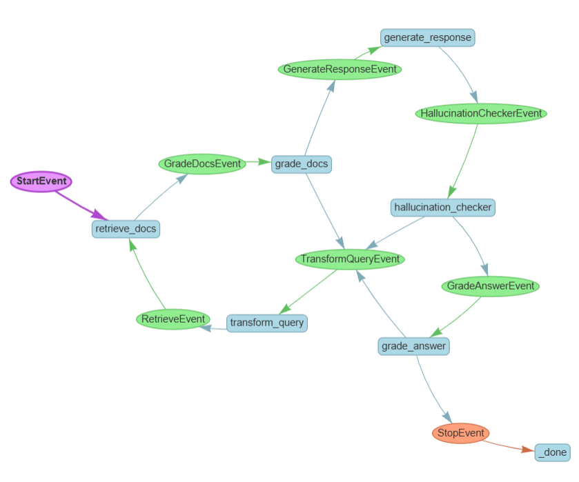

# self-corrective-rag-llamaindex
Self-Reflective Retrieval-Augmented Generation
# Self-Corrective-RAG Concept  

## Overview  
**Self-Corrective-RAG (Self-Reflective Retrieval-Augmented Generation)** is an advanced approach where the model iteratively refines its retrieval and generation processes to improve response accuracy and reliability. Unlike standard RAG, which retrieves context once before answering, Self-Corrective-RAG introduces a self-reflection mechanism that evaluates and enhances the retrieved information dynamically.  

## Self-Corrective-RAG llamaindex Workflow

## Key Steps  

1. **Initial Query & Retrieval**  
   - The model generates an initial query and retrieves relevant documents from the knowledge source.  

2. **Response Generation**  
   - Using the retrieved context, the model generates an initial response.  

3. **Self-Evaluation**  
   - The model assesses whether the response is well-grounded in the retrieved information.  
   - If gaps or inconsistencies are detected, the model proceeds to the next step.  

4. **Query Transformation & Re-Retrieval**  
   - The model **reformulates the query** to better target missing or ambiguous information.  
   - A new retrieval step is performed to obtain additional relevant context.  

5. **Final Response Generation**  
   - The model refines its answer based on the updated retrieved context, ensuring higher accuracy and factual grounding.  

## Benefits  
- **Reduces hallucinations** by iteratively verifying and improving retrieved knowledge.  
- **Improves response reliability** through self-reflection and query refinement.  
- **Enhances factual grounding** by dynamically adapting retrieval to missing or unclear information.  

## Implementation  
This implementation is inspired by the [LangGraph Self-Corrective-RAG example](https://github.com/langchain-ai/langgraph/blob/main/examples/rag/langgraph_self_rag.ipynb), but it has been built using **LlamaIndex** and **LangChain**.  

- **LlamaIndex**: A data framework designed to enable efficient retrieval and indexing of unstructured data, helping large language models interact with external knowledge sources.  
- **LangChain**: A powerful framework for building applications that integrate language models with various tools.

## Reference Paper  
The Self-Corrective-RAG approach aligns with the concepts discussed in:  
- **"Self-Corrective-RAG: Learning to Retrieve, Generate, and Critique for Robust Question Answering"** – (https://arxiv.org/abs/2310.11511) 

## How to use:
-   Clone this repository `git clone <repository-url>`
-   Initialize poetry with `poetry init -n`
-   Run `poetry config virtualenvs.in-project true` so that virtualenv will be present in project directory
-   Run `poetry env use <C:\Users\username\AppData\Local\Programs\Python\Python311\python.exe>` to create virtualenv in project (change username to your username)
-   Run `poetry shell`
-   Run `poetry install` to install requried packages
-   Create `.env` file and insert all keys: see `.env.example` file
-   Use rag.ipynb notebook to test self-corrective-rag concept